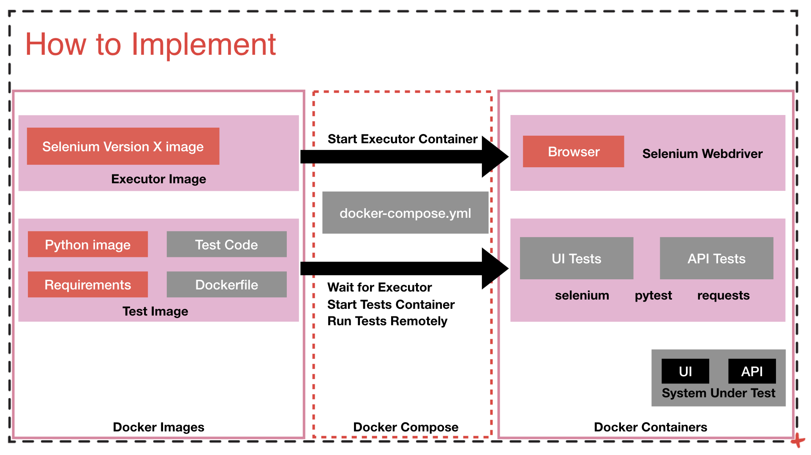

# Container Environment for Selenium and API Python Tests development

## Prepare IDE

1. Install `python3.7` or `python3.8` for your machine: [Python Install](https://www.python.org/downloads/)

2. Get the instructions here: [Pycharm Community Install](https://www.jetbrains.com/help/pycharm/installation-guide.html#standalone)

3. Create a github account if you don't have one: [https://github.com/](https://github.com/)

4. Install docker and docker compose: [Docker Install on Windows](https://docs.docker.com/docker-for-windows/install/),
[Docker-Compose Install](https://docs.docker.com/compose/install/)

## Selenium Docker Setup

The scope of the dockerized arhitecture in test setup is to have the same environment for all.
The tests will be run on a remote selenium host represented by a container created from an official selenium image.

The selenium images can be found [here](https://hub.docker.com/u/selenium/)

Instructions on selenium docker setup can be found [here](https://github.com/SeleniumHQ/docker-selenium)

The setup includes a host which has selenium and chrome installed.

The tests will reside in another container and will run remotely on the selenium host

## Services:

### Selenium
From official selenium image: selenium/standalone-chrome-debug:3.141.59-zirconium

For a complete list of versions see the tags on the [selenium github page/tags](https://github.com/SeleniumHQ/docker-selenium/tags) 
On each tag you will see the versions of browsers used.

### Tests Integration
Where the tests reside. The tests can be written in the `/tests` folder.

## Start the setup
`docker-compose up --build`

This command builds the test image from local files, gets the selenium image that is already
configured and starts the containers.

## Access the Selenium Host

[Install VNC Viewer](https://www.realvnc.com/en/connect/download/viewer/)

Using VNC on `localhost:5901` and password `secret` because the selenium container has VNC installed.

## Run the tests after changes

    docker-compose exec test-integration bash
    root@8954656e2a32:/selenium-python_wks# pytest -s -v

To run a specific test use the pytest parameter `-k testname`

To stop containers, in the projects folder run 
    
    docker-compose down

## Test Development

After the containers are started, if the volumes are set correctly, all the changes are instantly
available on the test container and can be run.

Check the folders eet in docker-compose under volumes match your local folder and the working directory.

in `docker-compose`:

    volumes:
            - /tmp:/tmp/results/
            - .:/rtc_docker_test_infra

in `Dockerfile`:

    WORKDIR /rtc_docker_test_infra
    ADD . /rtc_docker_test_infra

## Run all tests CI
To run all the tests without visual feedback from selenium, as they would run in a CI environment,
you can run the following command, using the CI special docker-compose file.

    docker-compose -f docker-compose-ci-zirconium.yml up --build --abort-on-container-exit

This will run the test as soon as the selenium host starts, and will stop all containers after the tests finish running.
The test results will be available on the local machine in `/tmp` as this folder is exposed as a volume.

For different versions of browsers packed into selenium docker images, you can copy the dockker-compose.yml file
and use another version. Explore the selenium docker-hub for version details. Then run on another version like this:

    docker-compose -f docker-compose-ci-alpha.yml up --build --abort-on-container-exit
  
## Extra Docker information

### Docker-Compose

[This `Get started with Docker Compose`](https://docs.docker.com/compose/gettingstarted/) intro is worth a read.

It will, at least, give you an idea on what it takes to use Docker Compose to run containers on a dev machine,
where you'd want a container to take into account code/test files changes.

### Docker commands cheat-sheet

[Docker commandline](https://docs.docker.com/engine/reference/commandline/docker/)

- Build image from a dockerfile

    `docker build -f <path_to_dockerfile> -t <image_name:tag>  --force-rm <path_to_contents>`

- List images

    `docker images`

- Get an image from the docker-hub

    `docker pull <image_name:tag>`

- Upload an image to docker-hub

    `docker push <image_name:tag>`

- Tag an image

    `docker tag <source_image_name:tag> <target_image_name:tag>`

- Spin a container from an image

    `docker run -it --rm -p <external_port:internal_port> <image_name:tag> <commands>`

- List containers that are running

    `docker ps`

- List all containers

    `docker ps -a`

- Run a command (e.g. open a shell session) on a running container

    First find out the ID or the name of the machine by running:

    `docker ps`

    Run the `docker exec` command, using the intended docker machine ID or name (either of them should work):

    `docker exec -it <machine ID or name> bash`

    E.g.:
    `docker exec -it 0e3816ba38a2 bash`

- Stop container

    `docker stop <container_id>`

- Delete container

    `docker rm <container_id>`

- Delete image

    `docker rmi <image_id>`

- Delete all containers that are not running

    `docker container prune`

- Delete all images that are not latest

    `docker image prune`

- Create a network

    `docker network create <network_name>`

- List existing networks

    `docker network list`

- See containers in the network

    `docker network inspect <network_name>`

- Remove a network

    `docker network rm <network_id>`

